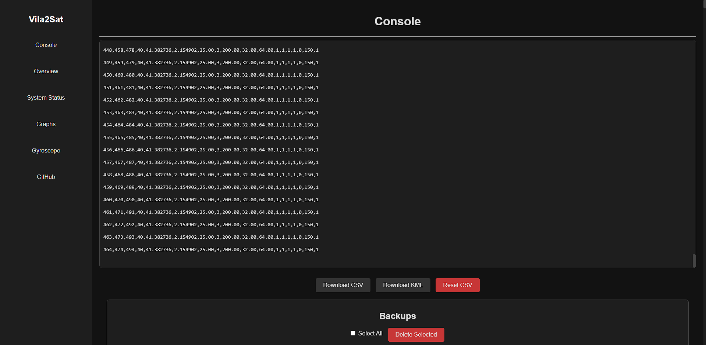
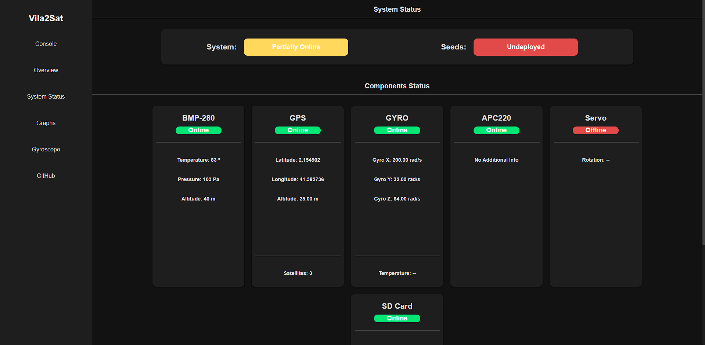
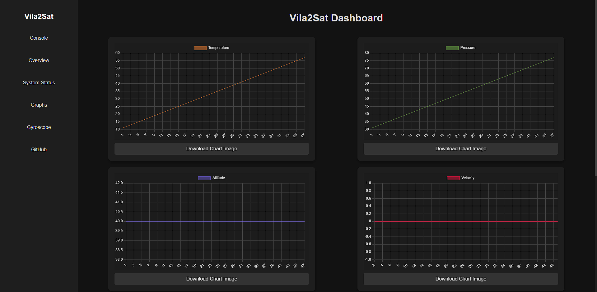
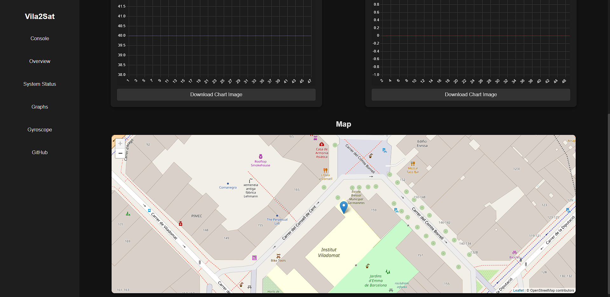
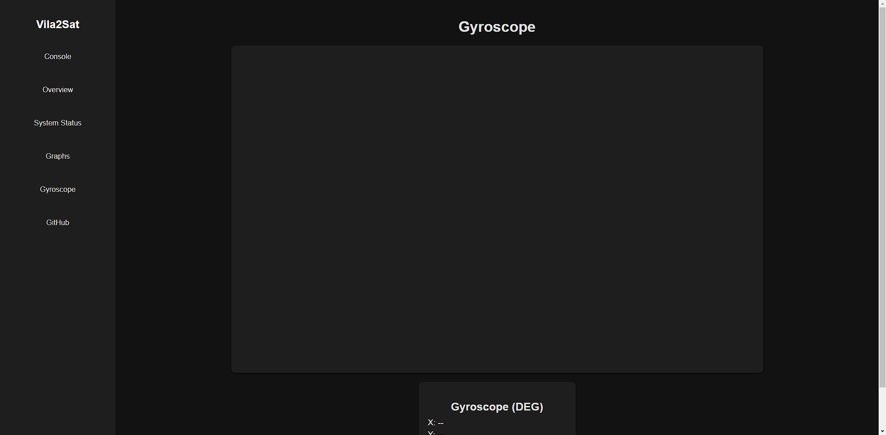
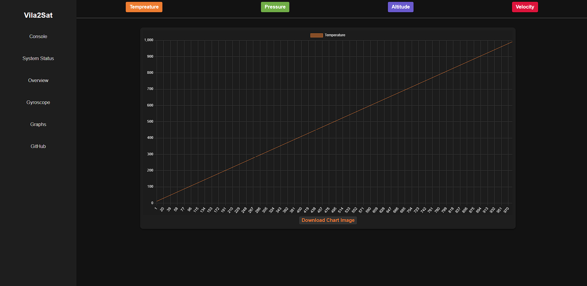
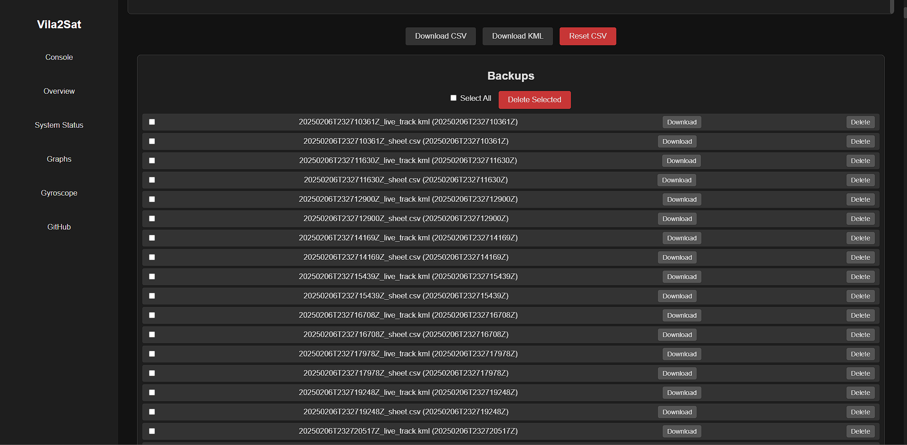

# CanSat-v2 Dashboard

Last year, I coded a dashboard for a cansat competition, it had a python processing script and a node.js dashboard. This project combines those two into a single Node.js application. It reads sensor data from a serial port, processes and logs it to CSV and MySQL, creates and updates a KML file for mapping, and broadcasts updates to a web dashboard via WebSocket.

<table>
  <tr>
    <td></td>
    <td></td>
  </tr>
  <tr>
    <td></td>
    <td></td>
  </tr>
    <tr>
    <td></td>
    <td></td>
  </tr>
    <tr>
    <td colspan="2" align="center"></td>
  </tr>
</table>


## Project Structure

```
# Project Structure: CANSAT-V2

CANSAT-V2/
├── images/                     # Stores image assets used in the project
├── lib/                        # Backend modules for data handling
│   ├── backupHandler.js        # Manages backup processes
│   ├── csvHandler.js           # Handles CSV file operations
│   ├── kmlHandler.js           # Manages KML file updates for GPS tracking
│   ├── mysqlHandler.js         # MySQL database handler (current version)
│   └── serialReader.js         # Reads data from the serial port
├── node_modules/               # Node.js dependencies
├── public/                     # Frontend static files
│   ├── css/                    # Stylesheets for UI design
│   │   ├── charts.css          # Styles for charts and graphs
│   │   ├── console.css         # Styles for the console interface
│   │   ├── gyro.css            # Styles for the gyroscope page
│   │   ├── nav.css             # Styles for navigation/sidebar
│   │   ├── status.css          # Styles for the system status page
│   │   └── style.css           # General styles for the project
│   └── js/                     # JavaScript files for frontend interactivity
│       ├── charts.js           # Handles chart updates and data visualization
│       ├── console.js          # Manages console data display
│       ├── gyro.js             # Handles gyroscope data visualization
│       ├── script.js           # General JavaScript logic for the project
│       └── status.js           # Manages system status updates
├── models/                     # 3D model files for visualization
│   ├── demo.obj                # 3D model of the CanSat (OBJ format)
│   └── obj.mtl                 # Material file for the 3D model
├── charts.html                 # Data visualization with graphs
├── console.html                # Serial console interface
├── gyro.html                   # Gyroscope data display
├── index.html                  # Main dashboard/homepage
├── status.html                 # System status overview
├── live_track.kml              # Real-time GPS tracking data
├── package.json                # Node.js project metadata and dependencies
├── package-lock.json           # Locks specific versions of installed dependencies
├── README.md                   # Project documentation (this file)
├── server.js                   # Node.js server script for APIs and WebSockets
└── sheet.csv                   # Logs sensor data from the hardware

```

## ⚙️ How It Works

### 1️⃣ Serial Data Reading & Processing
- **SerialPort and Parser:**  
  The `serialReader.js` module opens a serial port (configured for your Arduino/CanSat device) using the `serialport` package. It reads incoming data line by line.
- **Data Parsing:**  
  Each line is expected to be in the format `key = value`. The module collects these key/value pairs into a sensor data object.
- **Data Set Handling:**  
  When a new dataset is detected (e.g., when a new `Time` field appears and data has already been collected), the module:
    - Appends the data as a row in a CSV file using functions in `csvHandler.js`.
    - Updates backup files (both CSV and KML) via `backupHandler.js`.
    - Inserts the data row into a MySQL database using functions from `mysqlHandler.js`.
    - Updates a KML file (for mapping the sensor's track) with new coordinates using functions in `kmlHandler.js`.

### 2️⃣ Web Server & Dashboard
- **Express Server:**  
  `server.js` creates an Express server that serves static files from the `public` directory.
- **WebSocket Server:**  
  A WebSocket server (using the `ws` package) is created on top of the HTTP server. When clients connect, they receive the current CSV data.
- **File Watcher:**  
  The server watches the CSV file for changes. When new data is appended, it broadcasts the updated data to all connected WebSocket clients.
- **Dashboard Interface:**  
  The client-side code in `public/client.js` connects to the WebSocket server and updates the HTML (in `index.html`) in real time as new CSV data arrives.

### 3️⃣ MySQL Integration
- A MySQL connection pool is set up in `mysqlHandler.js` using the `mysql2` package.
- When the application starts, the module checks if an old `sensor_data` table exists, renames it with a timestamp, and creates a new `sensor_data` table.
- Each sensor data set is inserted into the MySQL table.

### 4️⃣ KML File Generation
- A KML file is created to track the sensor’s coordinates.
- As new coordinate data is received, the KML file is updated with a new line string representing the sensor's path and a "LookAt" view focusing on the latest coordinates.

### 5️⃣ Backups
- Backup copies of the CSV and KML files are created and updated regularly. This ensures data integrity and provides a historical record.

## 🚀 How to Use
### 🔹 1. Clone the Repository
- `git clone https://github.com/your-repo/cansat-dashboard.git`
- `cd cansat-dashboard`

### 🔹 2. Install Dependencies
- `npm install`

### 🔹 3. Configure the Application
- **Serial Port:**  
  In `lib/serialReader.js`, adjust the `portName` variable to match your device’s serial port.

### 🔹 4. Start the Server
- `npm start`

### 🔹 5. View the Dashboard
- Open your web browser and navigate to [http://localhost:3000](http://localhost:3000) to see the live dashboard updating as new sensor data is received.

### 🔹 6. Monitor Logs and Data
- The terminal will display logs for serial port activity, CSV file operations, MySQL insertions, KML updates, and backups.
- The CSV file (`sheet.csv`), KML file (`live_track.kml`), and any backup files (located in the `backup` folder) will be updated as new data is processed.

# License
Shield: [![CC BY-NC-SA 4.0][cc-by-nc-sa-shield]][cc-by-nc-sa]

This work is licensed under a
[Creative Commons Attribution-NonCommercial-ShareAlike 4.0 International License][cc-by-nc-sa].

[![CC BY-NC-SA 4.0][cc-by-nc-sa-image]][cc-by-nc-sa]

[cc-by-nc-sa]: http://creativecommons.org/licenses/by-nc-sa/4.0/
[cc-by-nc-sa-image]: https://licensebuttons.net/l/by-nc-sa/4.0/88x31.png
[cc-by-nc-sa-shield]: https://img.shields.io/badge/License-CC%20BY--NC--SA%204.0-lightgrey.svg


